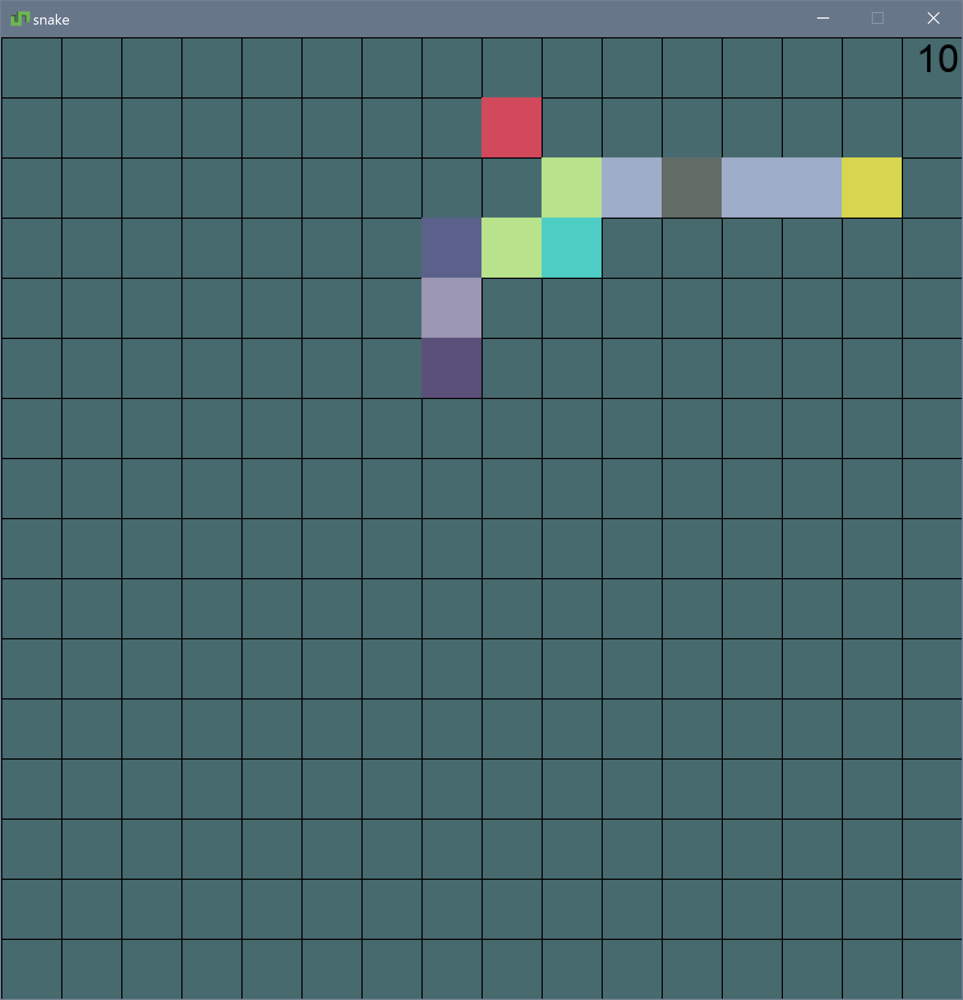

# snake

made with [pygame](https://www.pygame.org/) and [python 3.8](https://www.python.org/downloads/release/python-380/), should work on py3.6+ though

## play it yourself
`pip install -r requirements.txt`    
`python main.py`

## controls
`wasd` - movement    
`space` - to restart
red dot represents the apple
